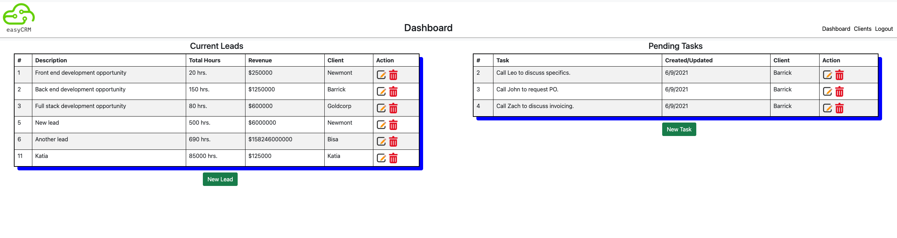
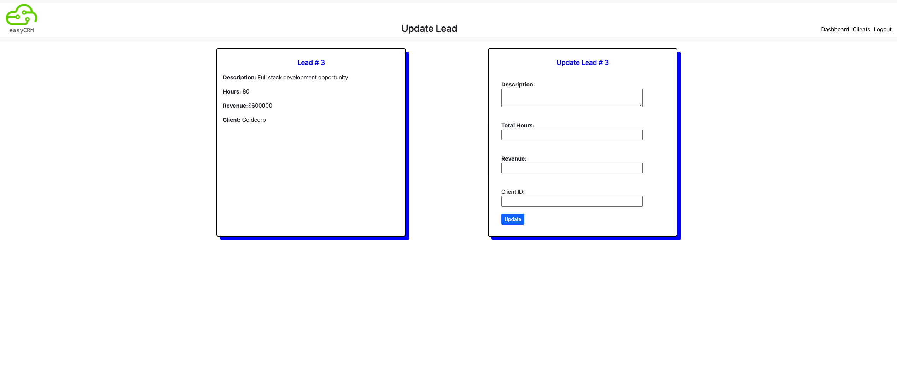
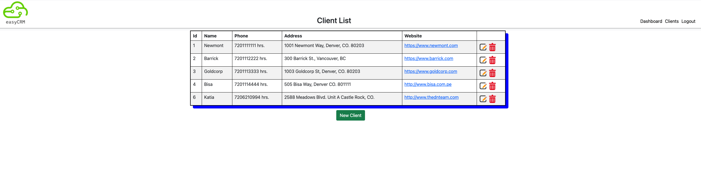

# easyCRM

## Description

This application provides the user with the ability to create and manage both tasks and leads. Both can be associated with a list of clients which can also be created and managed. Security is managed by a user database that can be managed as well.

## Reason for Development

I wanted to develop an application with functionality that is applicable to the real world immediately and with space for growth. Something people can find useful today.

## User Story

If I want to manage and track leads, tasks and relate them to my clients I can login into easyCRM and see my dashboard with my current leads and tasks. I can modify these, create new ones or even delete them. I can also see a list of my clients, which I can modify, delete or create new clients. If I am done with the application, I can log-out.

## Screenshots

## Links

### HEROKU

https://quiet-cove-79525.herokuapp.com/

### Repo

https://github.com/forbegos/easyCRM

## Future Development

- Add contacts module
- Add products module
- Add price lists
- Add currency manager
- Add revenue calculations based on products and price list
- Revamp UX/UI
- Add functionality to separate data by user id.

## License

